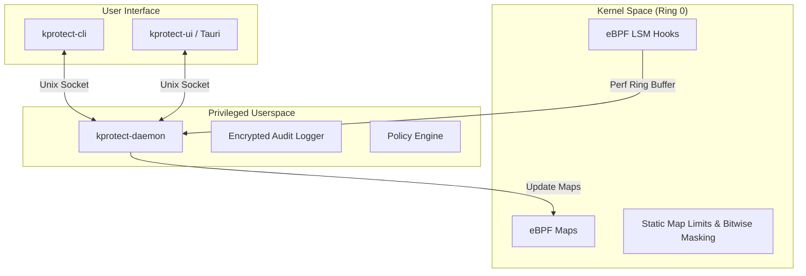

# kprotect Architecture Overview

This document provides a deep dive into the technical design decisions and cryptographic foundations of `kprotect`.

## 🏗️ System Overview

kprotect operates as a multi-layer security engine that bridges the gap between kernel-level enforcement and userspace management.

---

## ⚡ The Chain of Trust (Process Lineage)

The core innovation of kprotect is **Process Lineage tracking**. Unlike traditional LSMs that look at the process *subject*, kprotect looks at the process *ancestry*.

### 1. Lineage Signature
Every process is assigned a **Security Signature** computed in kernel space:
- **Algorithm**: $Sig_{child} = Sig_{parent} \oplus Hash(ExecutablePath)$
- **Hashing**: High-entropy **FNV-1a** (64-bit).
- **Enrichment**: For interpreters (Python, Node), we also hash `argv[1]` to distinguish between safe and malicious script executions.

### 2. Authorization Modes
- **Exact**: Matches the full lineage chain exactly.
- **Suffix**: Matches the end of a chain (e.g., `bash -> cat`), allowing for flexible tool usage within trusted environments.

---

## 🔐 Cryptographic Foundations

security is only as strong as its configuration. kprotect ensures that even if an attacker gains root access, they cannot tamper with the audit logs or policies without detection.

-   **Encryption**: **AES-256-GCM** (Authenticated Encryption).
-   **Key Derivation**: **HKDF-SHA256** binds the encryption key to the machine's unique identity (`/etc/machine-id`) and a randomly generated salt.
-   **Persistence**: All configuration files (`.enc`) are encrypted at rest with zero-knowledge to potential attackers.

---

## 🚀 Kernel Performance & Safety

Writing eBPF code requires a delicate balance of performance and verifiability.

### 1. Verifier Friendliness
We use **bitwise masking** (e.g., `index & 0x1F`) instead of standard bounds checks. This provides a mathematical guarantee to the eBPF verifier that memory access is always within bounds, eliminating the need for complex conditional branches.

### 2. Zero-Stack Design
To avoid the strictly limited 512-byte eBPF stack, we utilize **Per-CPU Scratch Buffers** (`PerCpuArray`). This allows for deep path inspections and complex hashing without risking a stack overflow or kernel panic.

---

## 🔑 Privilege Guard (Sudo Bypass)

The Privilege Guard hub provides a contextual sudo bypass mechanism:
1.  A custom **PAM Module** (`pam_kprotect.so`) intercepts sudo requests.
2.  It queries the `kprotect-daemon` via a Unix socket.
3.  The daemon validates the **Lineage Chain** of the user requesting elevation.
4.  If authorized, the user receives an instant bypass; otherwise, they are prompted for a password or denied.
