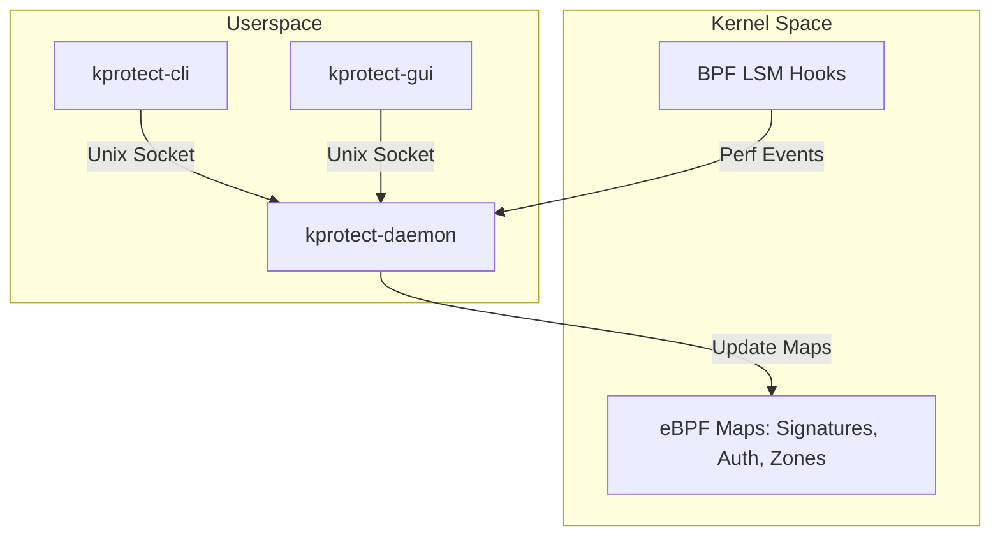

# 🛡️ kprotect

## Overview
kprotect is a kernel-level security engine designed to protect your sensitive data from supply-chain attacks (like malicious Python or Node.js libraries). It stands as an independent security layer for the most sensitive files.

- **eBPF-LSM Protection**: Intercepts file access at the kernel level based on path patterns and wildcards (e.g., `*.env`, `home/user/.ssh/*`).
- **Chain of Trust**: Instead of trusting just a binary, kprotect validates the **process lineage**. 
    - ✅ `VS Code` → `Terminal` → `cat` (If you authorized this chain)
    - ❌ `VS Code` → `Terminal` → `python unsafe.py` → `cat` (This cannot read your file because the chain is invalid)
- **Testing Ready**: Includes a robust system daemon, a power-user CLI, and a modern desktop GUI. All function implemented.


## 🚀 Key Innovation: The Chain of Trust

Traditional security tools often look at *what* a file is. kprotect looks at *where it came from*.

1.  **Lineage Tracking**: Every process is assigned a unique signature derived from its parent's signature and its own executable path.
2.  **Cryptographic Signatures**: Signatures are computed using FNV-1a hashing in kernel space, creating a provable "Chain of Trust" from the init process down to the leaf.
3.  **Red Zones**: Sensitive locations (e.g., `~/.ssh/id_rsa`, `.env` files, browser cookies) are marked as "Red Zones".
4.  **Zero-Trust Access**: Even a root process is **blocked** from accessing a Red Zone unless its specific execution lineage (signature) has been explicitly authorized.

---

## ✨ Features

-   **Kernel-Level Enforcement**: Uses BPF LSM hooks (`bprm_committed_creds`, `file_open`) for near-zero overhead and bypass-resistant protection.
-   **Encrypted Configuration**: All policies, authorizations, and logs are encrypted at rest using **AES-256-GCM**, keyed by a hardware-bound or system-specific secret.
-   **Rich Observability**:
    -   **Live Feed**: Real-time monitoring of process births, terminations, and blocked access attempts.
    -   **Audit Logs**: Tamper-evident logs of all security-critical actions.
-   **Multiple Interfaces**:
    -   **kprotect-daemon**: The core engine running as a systemd service.
    -   **kprotect-cli**: Direct command-line management.
    -   **kprotect-gui**: A modern, sleek desktop application built with Tauri and React.
-   **Dynamic Enrichment**: Captures process arguments for interpreters (Python, Node, Bash) to distinguish between `python safe_script.py` and `python malicious_script.py`.

---

## 🏗️ Architecture



---

## 📂 Project Structure

kprotect consists of two main components that should be installed in order:
1.  **kprotect Core**: The background daemon and CLI tool (Kernel interaction).
2.  **kprotect GUI**: The desktop dashboard for manageability.

---

## 🛠️ Installation & Setup

### 1. Prerequisites
- **Linux Kernel 5.10+** with BPF LSM support.
- **Kernel Parameters**: Ensure `lsm=lockdown,yama,apparmor,bpf` includes `bpf`. You can check this with `cat /sys/kernel/security/lsm`.

### 2. Core Engine Installation (Required)
Install the daemon first to enable kernel-level protection:
```bash
# Install the core debian package
sudo apt install ./target/kprotect_0.1.0-beta-1_amd64.deb
```
*The installer will automatically set up the systemd service.*

### 3. Desktop GUI Installation (Optional)
Install the GUI for a visual management experience:
```bash
# Install the GUI package
sudo apt install ./kprotect-ui/src-tauri/target/release/bundle/deb/kprotect-ui_0.1.0-beta_amd64.deb
```

### ⚠️ IMPORTANT: Post-Installation
**Please RESTART your computer after the first installation.**  
kprotect needs to track process lineage from the moment the system boots. Processes started *before* the daemon was installed will be marked as "No Chain" and cannot be accurately authorized.

---

## 💻 Developer: Building from Source
If you are building the project yourself, use the included helper scripts:
```bash
# Build the Core (Daemon & CLI)
./scripts/build_deb.sh

# Build the Desktop GUI
./scripts/build_gui.sh
```

## ⌨️ Basic CLI Usage
While the GUI is recommended, you can manage everything via `kprotect-cli`:
```bash
# Check system and eBPF map capacity
sudo kprotect-cli status

# View live security events
sudo kprotect-cli events --stream

# Authorize a bash-to-cat chain
sudo kprotect-cli authorize add "/usr/bin/bash,/usr/bin/cat" --mode Suffix --description "Dev tools"

# Protect a sensitive file
sudo kprotect-cli zone add red "/home/user/.ssh/id_rsa"
```

---

## 📂 Project Organization

-   `kprotect-ebpf`: The "brain" in the kernel. High-performance C-like Rust code using `aya`.
-   `kprotect-daemon`: The central hub. Manages eBPF lifetime, encryption, and state.
-   `kprotect-cli`: Light-weight interaction tool.
-   `kprotect-ui`: Desktop UI built with `Tauri` + `React` + `Vite` + `TailwindCSS`.
-   `kprotect-common`: Shared data structures and protocol definitions.

---

## 💖 Support the Project

If you find kprotect useful and want to support its development, consider buying me a coffee! Your support helps me dedicate more time to improving kprotect, adding new features, and maintaining the project.

[](https://ko-fi.com/khoinp1012)

Every contribution, no matter how small, is deeply appreciated and motivates me to keep building better security tools for the Linux community. Thank you! 🙏

---

## 📝 License

This project is licensed under the **GNU Affero General Public License v3.0 (AGPL-3.0)**. See the [LICENSE](LICENSE) file for details.

---

**Developed by [khoinp1012](https://github.com/khoinp1012)**
